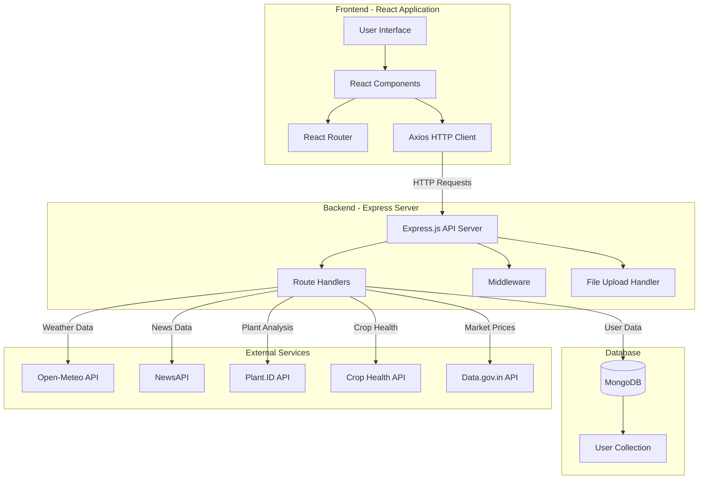
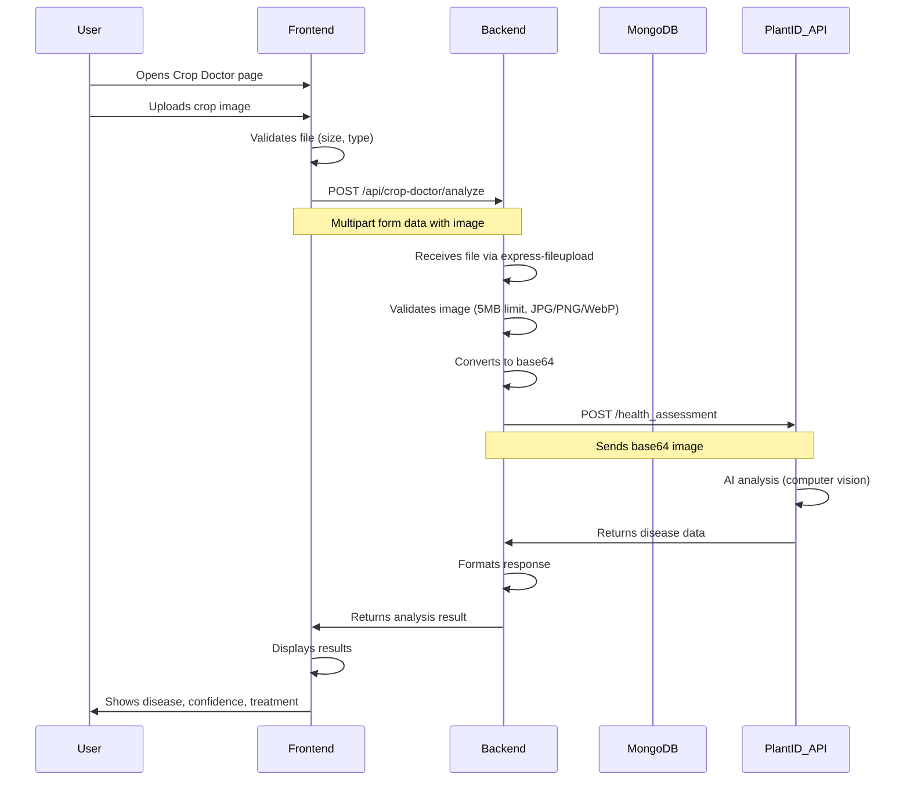

# 🌾 Mandi Mitra - Complete Project Documentation

## 📋 Table of Contents
1. [Project Overview](#project-overview)
2. [What Does This Project Do?](#what-does-this-project-do)
3. [Technology Stack](#technology-stack)
4. [Project Architecture](#project-architecture)
5. [Features in Detail](#features-in-detail)
6. [API Endpoints](#api-endpoints)
7. [Database Schema](#database-schema)
8. [External APIs Used](#external-apis-used)
9. [How Everything Works Together](#how-everything-works-together)

---

## 🎯 Project Overview

**Mandi Mitra** (meaning "Market Friend" in Hindi) is a comprehensive **Agricultural Assistant Platform** designed specifically for Indian farmers. It's a full-stack web application that helps farmers make better farming decisions by providing:

- 🌤️ **Real-time weather forecasts**
- 💰 **Live market prices** from mandis across India
- 🔬 **AI-powered crop disease detection**
- 📰 **Latest agricultural news**
- 🏛️ **Government schemes information**

---

## 🚀 What Does This Project Do?

### For Farmers:
This platform acts as a **one-stop digital assistant** for farmers, helping them:

1. **Check Weather**: Get detailed weather forecasts including temperature, humidity, rainfall, and soil moisture for their location
2. **Know Market Prices**: View current commodity prices in different states to decide when and where to sell their produce
3. **Diagnose Crop Problems**: Upload photos of crops to identify diseases, pests, or health issues using AI
4. **Stay Informed**: Read the latest news about agriculture, farming techniques, and government policies
5. **Access Government Schemes**: Learn about various government schemes and subsidies available for farmers

### The Problem It Solves:
- Farmers often lack access to real-time information about weather and market prices
- Crop diseases can destroy entire harvests if not identified early
- Information about government schemes doesn't reach rural areas effectively
- This platform brings all essential farming information to one place

---

## 🛠️ Technology Stack

### **Backend Technologies**

| Technology | Purpose | Why Used |
|------------|---------|----------|
| **Node.js** | Runtime environment | JavaScript on server-side, fast and scalable |
| **Express.js** | Web framework | Simple, flexible routing and middleware support |
| **MongoDB** | Database | NoSQL database, flexible schema for user data |
| **Mongoose** | ODM (Object Data Modeling) | Easier MongoDB interaction with schemas |
| **JWT (jsonwebtoken)** | Authentication | Secure, stateless user authentication |
| **bcrypt** | Password hashing | Secure password storage |
| **Axios** | HTTP client | Making API requests to external services |
| **express-fileupload** | File handling | Upload crop images for analysis |
| **dotenv** | Environment variables | Secure API key management |
| **CORS** | Cross-Origin Resource Sharing | Allow frontend-backend communication |

### **Frontend Technologies**

| Technology | Purpose | Why Used |
|------------|---------|----------|
| **React.js** | UI framework | Component-based, fast, modern UI development |
| **Vite** | Build tool | Fast development server and optimized builds |
| **React Router DOM** | Routing | Navigation between different pages |
| **Tailwind CSS** | Styling | Utility-first CSS, rapid UI development |
| **Axios** | HTTP client | API calls to backend |
| **React Toastify** | Notifications | User-friendly toast notifications |
| **Font Awesome** | Icons | Beautiful icons for UI elements |

### **External APIs Integrated**

| API | Purpose | Provider |
|-----|---------|----------|
| **Open-Meteo API** | Weather forecasting | Open-Meteo (Free) |
| **NewsAPI** | Agriculture news | NewsAPI.org |
| **Plant.ID API** | Plant identification & health | Kindwise |
| **Crop Health API** | Crop disease detection | Kindwise |
| **Insect ID API** | Pest identification | Kindwise |
| **Mushroom ID API** | Mushroom identification | Kindwise |
| **Data.gov.in API** | Commodity market prices | Government of India |

---

## 🏗️ Project Architecture

### **High-Level Architecture**



### **Directory Structure**

```
Mandi_Mitra/
│
├── backend/                    # Backend Express.js application
│   ├── index.js               # Main server file
│   ├── routes/                # API route handlers
│   │   ├── auth.js           # User authentication (login/signup)
│   │   ├── weather.js        # Weather forecast endpoints
│   │   ├── commodity.js      # Market price endpoints
│   │   ├── news.js           # News fetching endpoints
│   │   └── cropDoctor.js     # Crop disease detection endpoints
│   ├── models/               # Database models
│   │   └── User.js          # User schema and methods
│   ├── .env                  # Environment variables (API keys)
│   └── package.json          # Backend dependencies
│
├── frontend/                  # Frontend React application
│   ├── src/                  # Source files
│   │   ├── App.jsx          # Main app component with routing
│   │   ├── main.jsx         # Entry point
│   │   ├── AuthContext.jsx  # Authentication context
│   │   ├── components/      # Reusable components
│   │   │   └── Navigation.jsx
│   │   └── index.css        # Global styles
│   ├── pages/               # Page components
│   │   ├── Home.jsx         # Landing page
│   │   ├── Login.jsx        # Login page
│   │   ├── Signup.jsx       # Registration page
│   │   ├── WeatherForecast.jsx  # Weather page
│   │   ├── MandiPrice.jsx   # Market prices page
│   │   ├── CropDoctor.jsx   # Disease detection page
│   │   ├── News.jsx         # News page
│   │   └── GovSchemes.jsx   # Government schemes page
│   ├── index.html           # HTML template
│   ├── vite.config.js       # Vite configuration
│   └── package.json         # Frontend dependencies
│
└── README.md                # Project documentation
```

---

## 🎨 Features in Detail

### **1. User Authentication System**

#### What It Does:
- Allows farmers to create accounts and login securely
- Stores user information safely in MongoDB
- Uses JWT tokens for session management

#### How It Works:
1. **Signup Process**:
   - User provides: Full Name, Email, Mobile Number, Password
   - Backend validates data (checks for duplicates)
   - Password is hashed using bcrypt (10 salt rounds)
   - User data saved to MongoDB
   
2. **Login Process**:
   - User provides: Email and Password
   - Backend finds user in database
   - Compares hashed password using bcrypt
   - Generates JWT token (valid for 1 day)
   - Returns token to frontend for authenticated requests

#### Technologies Used:
- **bcrypt**: Password hashing and comparison
- **jsonwebtoken**: JWT token generation
- **Mongoose**: Database operations

---

### **2. Weather Forecast System**

#### What It Does:
- Provides current weather and 7-day forecast
- Shows agricultural data: soil moisture, UV index, humidity
- Location-based using GPS coordinates

#### How It Works:
1. User allows location access or enters coordinates
2. Frontend sends latitude/longitude to backend
3. Backend validates coordinates (-90 to 90 for lat, -180 to 180 for lon)
4. Makes request to Open-Meteo API with parameters:
   - Current weather
   - Hourly data: temperature, precipitation, humidity, wind speed, soil moisture
   - Daily data: max/min temperature, sunrise/sunset, UV index
5. Returns formatted weather data to frontend
6. Frontend displays in user-friendly format with icons

#### API Endpoint:
```
GET /api/weather/current?lat=28.7041&lon=77.1025
```

#### Data Provided:
- Current temperature, wind speed, weather condition
- Hourly forecasts (temperature, rain, humidity)
- 7-day forecast (high/low temps, precipitation)
- Soil moisture (important for irrigation decisions)
- UV index (for sun protection)
- Sunrise/sunset times

#### Technologies Used:
- **Open-Meteo API**: Free weather data
- **Axios**: HTTP requests
- **Express validation middleware**: Input validation

---

### **3. Market Price Information (Mandi Prices)**

#### What It Does:
- Shows current commodity prices from mandis across India
- Helps farmers decide when and where to sell produce
- Covers grains, vegetables, fruits, pulses

#### How It Works:
1. User selects their state
2. Frontend requests prices for that state
3. Backend calls Data.gov.in API (Government of India)
4. Fetches up to 5000 records
5. Filters records by selected state (case-insensitive)
6. Returns commodity data with:
   - Commodity name
   - Market (Mandi) name
   - Minimum price
   - Maximum price
   - Modal price (most common price)
   - Arrival date

#### API Endpoints:
```
GET /api/commodity/prices?state=Karnataka
GET /api/commodity/available-states
GET /api/commodity/check-api-key
```

#### Technologies Used:
- **Data.gov.in API**: Government commodity price data
- **HTTPS Agent**: Secure API communication
- **Axios**: HTTP requests with 60-second timeout

---

### **4. Crop Doctor (AI Disease Detection)**

#### What It Does:
- Identifies crop diseases from photos
- Detects pests and insects
- Identifies mushrooms
- Provides health assessment and treatment suggestions

#### How It Works:

**Step-by-Step Process:**

1. **Image Upload**:
   - User takes photo of crop/plant/insect
   - Uploads through frontend form
   - File size limited to 5MB
   - Accepts: JPG, PNG, WebP formats

2. **Backend Processing**:
   - Receives image via express-fileupload
   - Validates file type and size
   - Converts image to base64 encoding
   - Determines analysis type (plant/crop/insect/mushroom)

3. **AI Analysis**:
   - Sends base64 image to appropriate API:
     - **Plant**: Plant.ID API → `/health_assessment`
     - **Crop**: Crop Health API → `/health_assessment`
     - **Insect**: Insect ID API → `/identification`
     - **Mushroom**: Mushroom ID API → `/identification`
   - APIs use computer vision and machine learning
   - Returns disease/pest identification with confidence scores

4. **Result Formatting**:
   - Extracts disease suggestions
   - Calculates probability percentages
   - Formats treatment recommendations
   - Returns structured JSON response

5. **Frontend Display**:
   - Shows health status (healthy/diseased)
   - Lists detected diseases with confidence levels
   - Displays similar images for comparison
   - Provides treatment suggestions

#### API Endpoints:
```
POST /api/crop-doctor/analyze
POST /api/crop-doctor/identify
GET /api/crop-doctor/health
```

#### Request Format:
```javascript
// Multipart form data
{
  image: <file>,
  type: "plant" | "crop" | "insect" | "mushroom"
}
```

#### Response Format:
```json
{
  "type": "plant",
  "isHealthy": false,
  "confidence": 0.89,
  "diseases": [
    {
      "name": "Leaf Rust",
      "probability": 89,
      "description": "Detected Leaf Rust with 89% confidence",
      "treatment": "Treatment recommendations...",
      "similarImages": [...]
    }
  ],
  "plant": {
    "name": "Wheat",
    "probability": 0.95
  }
}
```

#### Technologies Used:
- **Plant.ID API**: Plant identification and health
- **Kindwise APIs**: Crop, insect, mushroom identification
- **express-fileupload**: File handling
- **Buffer**: Image data processing
- **Base64 encoding**: Image format for API

---

### **5. Agricultural News**

#### What It Does:
- Fetches latest agriculture-related news
- Covers farming, agri-tech, farmer welfare
- News from reliable sources in English

#### How It Works:
1. Frontend requests news from backend
2. Backend queries NewsAPI with keywords:
   - "agriculture"
   - "farming"
   - "farmers"
   - "agri-tech"
3. Sorts by published date (latest first)
4. Returns articles with:
   - Title
   - Description
   - URL
   - Image
   - Source
   - Published date

#### API Endpoint:
```
GET /api/news/
```

#### Technologies Used:
- **NewsAPI**: News aggregation service
- **node-fetch**: HTTP requests

---

### **6. Government Schemes**

#### What It Does:
- Displays information about government schemes for farmers
- Covers subsidies, loans, insurance, welfare programs
- Static information page (no backend API)

#### Content Includes:
- PM-KISAN (Direct income support)
- Crop insurance schemes
- Soil health card scheme
- Agricultural loans and subsidies
- Farmer welfare programs

---

## 🔌 API Endpoints

### **Authentication Routes** (`/api/auth`)

| Method | Endpoint | Description | Request Body | Response |
|--------|----------|-------------|--------------|----------|
| POST | `/signup` | Register new user | `{fullName, email, mobile, password}` | `{message: "User created successfully"}` |
| POST | `/login` | User login | `{email, password}` | `{token, user: {id, fullName, email}}` |

---

### **Weather Routes** (`/api/weather`)

| Method | Endpoint | Description | Query Params | Response |
|--------|----------|-------------|--------------|----------|
| GET | `/current` | Get weather forecast | `lat, lon` | Weather data object |

---

### **Commodity Routes** (`/api/commodity`)

| Method | Endpoint | Description | Query Params | Response |
|--------|----------|-------------|--------------|----------|
| GET | `/prices` | Get market prices | `state` | Array of commodity records |
| GET | `/available-states` | List available states | - | `{availableStates: [...]}` |
| GET | `/check-api-key` | Verify API key | - | `{valid: true/false}` |

---

### **Crop Doctor Routes** (`/api/crop-doctor`)

| Method | Endpoint | Description | Request Body | Response |
|--------|----------|-------------|--------------|----------|
| POST | `/analyze` | Analyze crop health | `{image: file, type: string}` | Disease analysis object |
| POST | `/identify` | Identify plant | `{image: file}` | Plant identification object |
| GET | `/health` | Check service status | - | Service health status |

---

### **News Routes** (`/api/news`)

| Method | Endpoint | Description | Query Params | Response |
|--------|----------|-------------|--------------|----------|
| GET | `/` | Get agriculture news | - | Array of news articles |

---

## 💾 Database Schema

### **User Model** (MongoDB Collection: `users`)

```javascript
{
  fullName: {
    type: String,
    required: true,
    unique: true
  },
  email: {
    type: String,
    required: true,
    unique: true
  },
  mobile: {
    type: String,
    required: true,
    unique: true
  },
  password: {
    type: String,
    required: true,
    // Stored as bcrypt hash
  }
}
```

**Methods:**
- `comparePassword(candidatePassword)`: Compares plain password with hashed password
- Pre-save hook: Automatically hashes password before saving

---

## 🌐 External APIs Used

### **1. Open-Meteo API**
- **Purpose**: Weather forecasting
- **Cost**: Free
- **Endpoint**: `https://api.open-meteo.com/v1/forecast`
- **Data**: Temperature, precipitation, humidity, wind, soil moisture, UV index
- **Documentation**: https://open-meteo.com/

### **2. NewsAPI**
- **Purpose**: Agriculture news
- **Cost**: Free tier available
- **Endpoint**: `https://newsapi.org/v2/everything`
- **API Key**: `0e1b5a16c967431b9a3eaa6e211e33b3`
- **Documentation**: https://newsapi.org/docs

### **3. Plant.ID API (Kindwise)**
- **Purpose**: Plant identification and health assessment
- **Endpoint**: `https://plant.id/api/v3`
- **API Key**: Configured in `.env`
- **Features**: Disease detection, plant identification
- **Documentation**: https://web.plant.id/

### **4. Crop Health API (Kindwise)**
- **Purpose**: Crop disease detection
- **Endpoint**: `https://crop.kindwise.com/api/v1`
- **API Key**: Configured in `.env`
- **Features**: Health assessment, disease identification

### **5. Insect ID API (Kindwise)**
- **Purpose**: Pest identification
- **Endpoint**: `https://insect.kindwise.com/api/v1`
- **API Key**: Configured in `.env`
- **Features**: Insect identification, pest detection

### **6. Mushroom ID API (Kindwise)**
- **Purpose**: Mushroom identification
- **Endpoint**: `https://mushroom.kindwise.com/api/v1`
- **API Key**: Configured in `.env`
- **Features**: Mushroom species identification

### **7. Data.gov.in API**
- **Purpose**: Commodity market prices
- **Endpoint**: `https://api.data.gov.in/resource/9ef84268-d588-465a-a308-a864a43d0070`
- **API Key**: `579b464db66ec23bdd000001c930d933dc864d2c60dcf9070a7006d3`
- **Data**: Mandi prices across India
- **Documentation**: https://data.gov.in/

---

## 🔄 How Everything Works Together

### **Complete User Journey Example: Checking Crop Health**



### **Data Flow Architecture**

1. **User Authentication Flow**:
   ```
   User → Login Form → Frontend → Backend → MongoDB → JWT Token → Frontend → Local Storage
   ```

2. **Weather Data Flow**:
   ```
   User Location → Frontend → Backend → Open-Meteo API → Backend → Frontend → Display
   ```

3. **Market Price Flow**:
   ```
   State Selection → Frontend → Backend → Data.gov.in API → Filter by State → Frontend → Display
   ```

4. **Crop Analysis Flow**:
   ```
   Image Upload → Frontend → Backend → Base64 Conversion → Plant.ID API → AI Analysis → Backend → Frontend → Results Display
   ```

---

## 🔐 Security Features

1. **Password Security**:
   - Passwords hashed with bcrypt (10 salt rounds)
   - Never stored in plain text
   - Secure comparison using bcrypt.compare()

2. **JWT Authentication**:
   - Stateless authentication
   - Tokens expire after 1 day
   - Secure token generation

3. **API Key Management**:
   - All API keys stored in `.env` file
   - Not committed to version control
   - Environment-based configuration

4. **Input Validation**:
   - Coordinate validation for weather
   - File size and type validation for images
   - Email and mobile uniqueness checks

5. **CORS Configuration**:
   - Controlled cross-origin access
   - Prevents unauthorized API access

---

## 📊 Key Statistics

- **Total Routes**: 12 API endpoints
- **External APIs**: 7 different services
- **Frontend Pages**: 8 pages
- **Database Collections**: 1 (Users)
- **File Upload Limit**: 5MB
- **JWT Token Validity**: 1 day
- **Supported Image Formats**: JPG, PNG, WebP
- **Weather Forecast**: 7 days
- **Commodity Records**: Up to 5000 per request

---

## 🎓 Learning Points

### **What You Can Learn From This Project**:

1. **Full-Stack Development**:
   - Building RESTful APIs with Express.js
   - Creating React applications with modern hooks
   - Database integration with MongoDB

2. **Authentication & Security**:
   - JWT-based authentication
   - Password hashing with bcrypt
   - Secure API key management

3. **External API Integration**:
   - Working with multiple third-party APIs
   - Handling API responses and errors
   - Rate limiting and timeout management

4. **File Handling**:
   - Image upload and processing
   - Base64 encoding
   - File validation

5. **Modern Frontend**:
   - React Router for navigation
   - Context API for state management
   - Tailwind CSS for styling
   - Responsive design

6. **Real-World Problem Solving**:
   - Building applications for social impact
   - Understanding user needs (farmers)
   - Integrating multiple data sources

---

## 🚀 Future Enhancements

Based on the README roadmap:

- [ ] Weather-based crop recommendations
- [ ] Offline mode for rural areas
- [ ] Voice assistant integration
- [ ] Regional language support expansion
- [ ] IoT sensor integration
- [ ] Marketplace integration

---

## 📝 Summary

**Mandi Mitra** is a comprehensive agricultural platform that combines:
- Modern web technologies (MERN stack)
- AI-powered crop analysis
- Real-time data from multiple sources
- User-friendly interface for farmers

It demonstrates full-stack development, API integration, authentication, file handling, and building applications with real social impact. The project helps farmers make informed decisions about weather, market prices, and crop health, all in one place.
